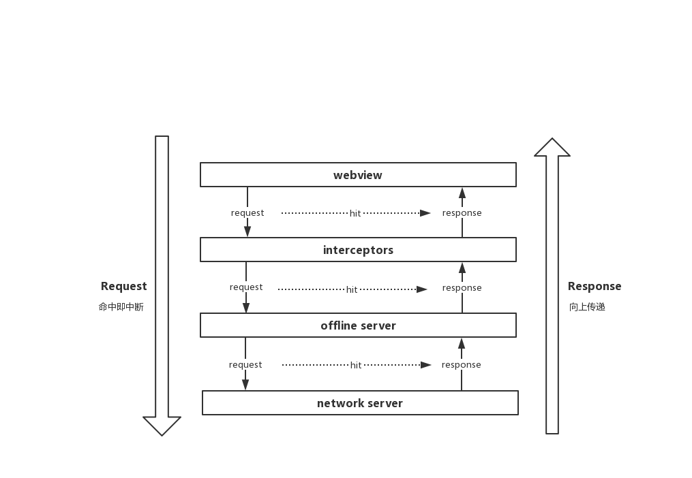

# FastWebView
## 背景
Android原生WebView有磁盘缓存最大上限，在4.4之前只有10M，在4.4及其之后虽然提升至20M，但对频繁的H5业务场景来说，还是太小了。我们有很多业务界面使用H5实现，在使用正常HTTP缓存协议对资源缓存时，
太小的缓存空间很容易导致页面缓存被清除，从而重新加载。不仅浪费用户的流量，加载速度慢也会造成不好的用户体验。FastWebView旨在解决这些痛点，通过自定义本地缓存的方式，
不仅突破了原生WebView缓存大小限制，还可以让开发者自由定制本地缓存大小，支持预加载和离线加载，并友好的支持离线包方案，可以大幅提升H5加载速度。在项目实践数据证明，优化效果达到40%以上。

## 特性
1. 自定义本地缓存，突破原生webview缓存限制
2. 提供默认、正常和强制三种缓存模式
3. 提供资源拦截器支持自定义读取静态资源（比如读取assets/sdcard中的资源替换在线资源）
4. 支持离线加载/预加载
5. cookie自动缓存和发布

## 使用方法
将原生的WebView替换为FastWebView，并选择相应的缓存模式。

Fast提供了以下3种缓存模式：

1. FastCacheMode.DEFAULT  // 默认缓存模式
2. FastCacheMode.NORMAL // 正常缓存模式
3. FastCacheMode.FORCE // 强制缓存模式

### 默认缓存模式

使用默认缓存模式时，FastWebView和原生webview无任何差异, 不会有任何的代码侵入。

```
FastWebView fastWebView = new FastWebView(this);
fastWebView.setCacheMode(FastCacheMode.DEFAULT);
```

### 正常缓存模式

使用正常缓存模式时，默认的网络请求方式由HttpUrlConnection切换为OkHttp，磁盘缓存上限提升为100MB。

```
FastWebView fastWebView = new FastWebView(this);
fastWebView.setCacheMode(FastCacheMode.NORMAL);
```

### 强制缓存模式

使用强制缓存模式时，默认的网络请求方式由HttpUrlConnection切换为OkHttp，并且FastWebView会无视HTTP缓存协议，强制缓存所加载H5中所有不被过滤器过滤的静态资源。

```
FastWebView fastWebView = new FastWebView(this);
fastWebView.setCacheMode(FastCacheMode.FORCE, cacheConfig);
```

默认的过滤器会过滤所有音视频和**html**等资源类型：（即以下类型的资源不会被缓存，但支持HTTP缓存协议）

```
public DefaultMimeTypeFilter() {
    addMimeType("text/html");
    // audio
    addMimeType("audio/mpeg");
    addMimeType("audio/midi");
    addMimeType("audio/webm");
    addMimeType("audio/ogg");
    addMimeType("audio/wave");
    addMimeType("audio/wav");
    addMimeType("audio/x-wav");
    addMimeType("audio/mp4");
    addMimeType("audio/x-pn-wav");
    addMimeType("audio/x-ms-wma");
    // video
    addMimeType("video/webm");
    addMimeType("video/ogg");
    addMimeType("video/x-msvideo");
    addMimeType("video/mp4");
    addMimeType("video/mpeg");
    addMimeType("video/quicktime");
    addMimeType("video/x-ms-wmv");
    addMimeType("video/x-flv");
    addMimeType("video/x-matroska");
}
```

#### 强制缓存模式的配置选项

```
fastWebView.setCacheConfig(new CacheConfig.Builder()
        .setCacheDir(String fileDir)
        .setExtensionFilter(ExtensionFilter filter)
        .setVersion(int version)
        .setDiskCacheSize(long diskCacheSize)
        .build());
```

1. setCacheDir(String fileDir) 设置强制缓存目录
2. setExtensionFilter(ExtensionFilter filter) 设置资源类型过滤器
3. setVersion(int version) 设置缓存版本，默认为1
4. setDiskCacheSize(long diskCacheSize) 设置磁盘缓存上限大小

#### 强制缓存模式下如何更新静态资源？

由于FastWebView的强制缓存模式会强制缓存静态资源文件到本地，并且优先使用本地资源。

所以如果需要更新静态资源文件，需要和前端达成约定一致，当静态资源更新时，保证静态资源url地址发生改变。url变化后，FastWebView会重新从网络下载。

### 资源加载拦截器

> 注意：ResourceInterceptor只对NORMAL和FORCE两种缓存模式生效。

拦截器功能可以让你从任何自定义的文件位置加载静态资源，比如assets目录。

添加拦截器方式如下：

```
FastWebView fastWebView = new FastWebView(this);
fastWebView.addResourceInterceptor(new ResourceInterceptor() {
    @Override
    public WebResourceResponse load(Chain chain) {
    	CacheRequest request = chain.getRequest();
    	// 1.process request	
    	WebResourceResponse response = processRequest(request);
    	if (response != null) {
    		return response;
    	}
    	// 2.pass request to next interceptor
        return chain.process(request);
    }
});
```
### Cookie选项
#### Cookie缓存模式
FastWebView实现了Cookie的自动缓存，并提供了以下两种缓存模式：
```
CookieStrategy.MEMORY; // 内存缓存模式
CookieStrategy.PERSISTENT; // 持久缓存模式
```
可以通过以下方式来设置Cookie缓存模式：

```
FastCookieManager cookieManager = fastView.getFastCookieManager();
cookieManager.setCookieStrategy(CookieStrategy strategy)
```

#### Cookie拦截器
Cookie拦截器用来拦截请求和响应获取到的Cookie列表，从而实现添加自定义Cookie的功能：
```
FastCookieManager cookieManager = fastView.getFastCookieManager();
cookieManager.addRequestCookieInterceptor(CookieInterceptor interceptor);
cookieManager.addResponseCookieInterceptor(CookieInterceptor interceptor);
```
### 执行JS脚本

```
fastWebView.runJs(String function, Object... args);
```

### 预加载
由于首次加载资源时，需要完整加载整个H5页面，加载速度跟原生webview无异。但我们可以使用preload来预加载页面。
```
FastWebView.preload(Context context, String url)
```

## 原理设计图


